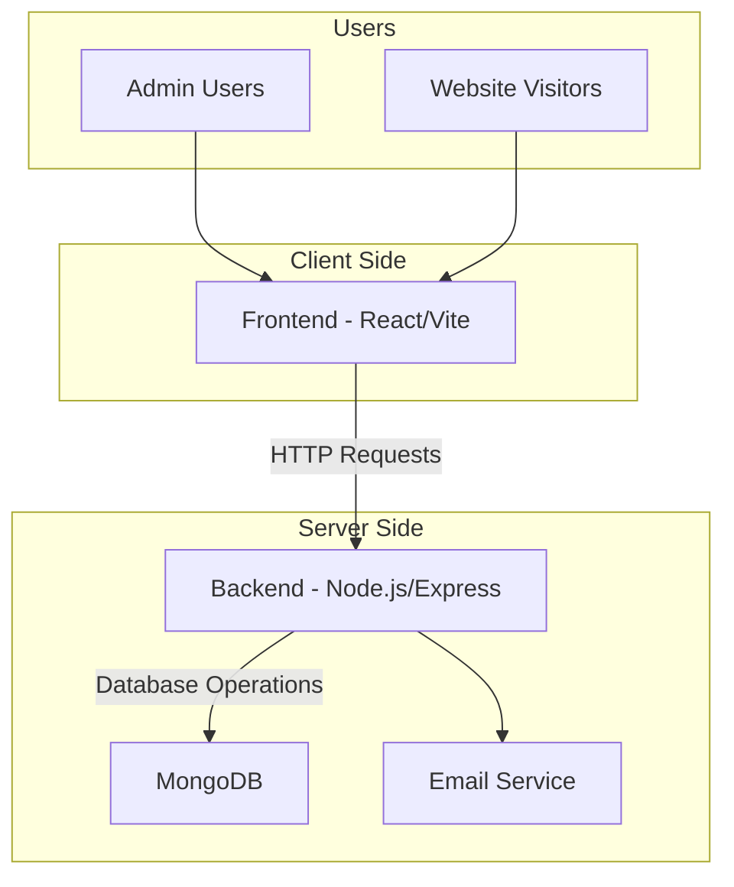
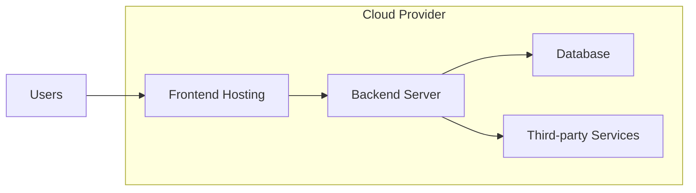

# System Architecture

## Overview

## Component Details

### Frontend (Client Side)
- **Framework**: React with TypeScript
- **Build Tool**: Vite
- **Styling**: Tailwind CSS
- **State Management**: React hooks and Context API
- **Routing**: React Router
- **API Client**: Custom fetch wrapper

### Backend (Server Side)
- **Runtime**: Node.js
- **Framework**: Express.js
- **Database**: MongoDB with Mongoose
- **Authentication**: JWT
- **Validation**: Built-in validation
- **CORS**: Configured for frontend domain

### Data Flow

1. **User Interaction**:
   - User interacts with React components
   - Components trigger API calls to backend

2. **API Communication**:
   - Frontend sends HTTP requests to backend endpoints
   - Backend processes requests and queries database
   - Backend returns JSON responses

3. **Data Processing**:
   - Backend validates input data
   - Backend performs database operations
   - Backend sends responses back to frontend

4. **UI Updates**:
   - Frontend receives responses
   - React components update state
   - UI re-renders with new data

## API Endpoints

### Public Endpoints
- `POST /api/contact` - Submit contact form
- `GET /api/services` - Get all services
- `GET /api/careers` - Get all career listings

### Admin Endpoints
- `POST /api/admin/login` - Admin authentication
- `GET /api/admin/contacts` - Get all contacts
- `GET /api/admin/services` - Get all services

## Security

- **CORS**: Restricts which domains can access the API
- **JWT**: Secures admin endpoints
- **Validation**: Input validation on both frontend and backend
- **Environment Variables**: Sensitive configuration stored separately

## Deployment Architecture

